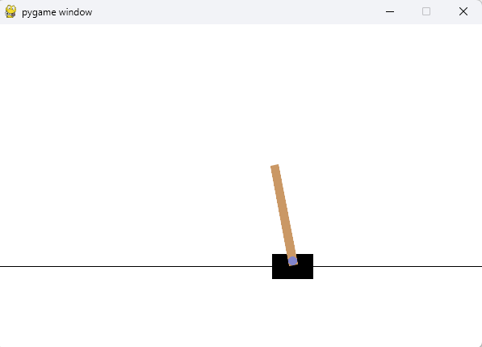

# DQN- Deep Q Network (Q Learning + Neural Network)
-This project implements a Deep Q-Network (DQN) agent using PyTorch to learn the CartPole-v1 environment
through trial and error. The agent uses experience replay and a target network to stabilize learning 
while balancing exploration and exploitation. Over multiple episodes, the neural network learns a 
policy that attempts to keep the pole balanced as long as possible.

# Double DQN -
-In DQN The same network: chooses the best action  and evaluates that action
-next_q = target_net(next_states).max(1)[0]
-In double DQN
-Policy Net → chooses best action
-Target Net → evaluates that action
# Action selection using policy_net
-next_actions = torch.argmax(policy_net(next_states), dim=1, keepdim=True)
# Action evaluation using target_net
-next_q = target_net(next_states).gather(1, next_actions)

# Explination in terms of DOG getting trained.
-We create a dog with a brain (neural network) and put it in a game (CartPole).
The dog tries actions, gets rewards, remembers what happened, and slowly updates its brain.
One brain learns, another brain gives stable advice.
Over many attempts, the dog learns how to balance the pole without falling.

# Create the Dog’s Brain (Neural Network)
-class DQN(nn.Module):

# Create the World (Environment)
-env = gym.make("CartPole-v1")

# Create TWO Brains
-policy_net  # learning brain
-target_net  # teaching brain

# Set Learning Rules (Hyperparameters)
-These are training rules:
-epsilon → how curious the dog is
-gamma → how much future rewards matter
-memory → diary of past experiences
-batch_size → how many memories to learn from
-episodes → how many training days

# Action Selection (Explore vs Exploit)
-select_action(state)

# Experience Storage (Memory)
-store_experience(s, a, r, s_next, done)

# Learning Step (train_step)
-This is where real learning happens.

# Training Loop (Daily Practice)
-Each episode = one full attempt.

# Slowly Reduce Randomness
-“I’ve learned enough. I’ll trust my brain more now.”

# Update Teacher Brain Occasionally
-target_net.load_state_dict(policy_net.state_dict())

